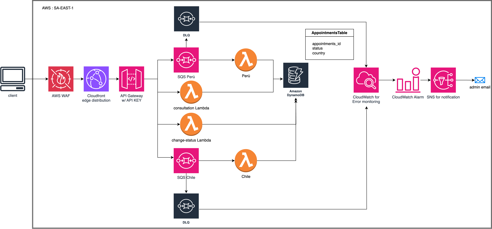
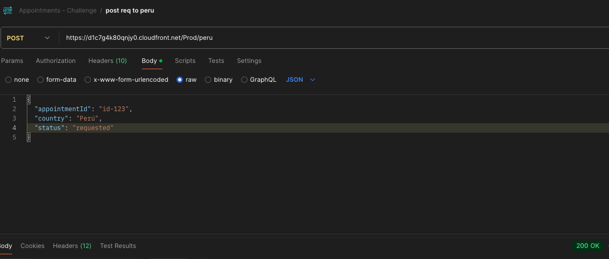
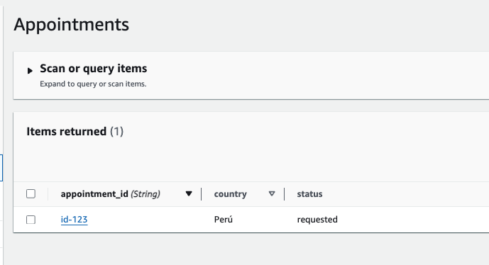
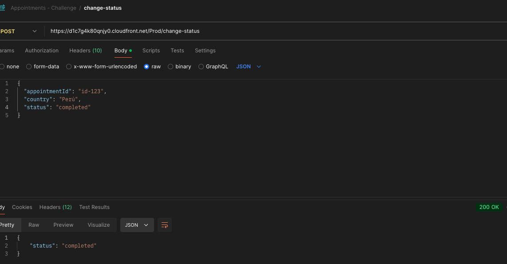
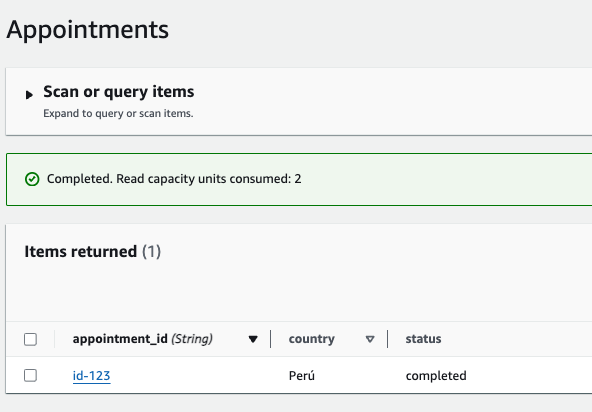

# Sistema de Agendamiento de Citas Médicas - Arquitectura Serverless AWS

## 1. Diseño de Arquitectura

La arquitectura propuesta utiliza servicios serverless de AWS para crear un sistema que es escalable, mantenible y confiable para gendamiento de citas

- AWS Cloudfront con WAF y Shield: Protección ante injección SQL y ataques DDoS, respectivamente.
- API Gateway: Punto de acceso para solicitudes. Se implementó 4 rutas principales: 2 POST para Perú & Chile, 1 POST para cambiar status de citas y 1 GET para recibir todas las citas. Nota: Ruta POST para cambiar status hecha de manera manual.
- SQS FIFO Queues: Cola tipo buffer para las solicitudes,con aseguramiento de orden y eliminación de duplicidad, en caso las citas dependan de cantidad de doctores disponibles y o se manden solicitudes duplicadas. Se consideró el appointmentId como identificador de duplicidad.
- SQS DLQ Queues: Cola tipo Dead Letter para almacenar las citas fallidas (Creado manualmente)
- Lambda Functions: Funciones serverless que procesan las citas por país.
- DynamoDB: Almacenamiento de datos de citas. Actualmente registra: ID de la cita, status y país.
- CloudWatch: Monitoreo y manejo de errores.
- SNS: Notificaciones de errores que puede ser implementada a emails (no implementado en el código provisto)

Flujo de datos:

1. Solicitudes llegan a Cloudfront edge, luego alcanzan API Gateway y se enrutan a colas SQS FIFO por país.
2. Funciones Lambda procesan las solicitudes y actualizan DynamoDB.
3. DynamoDB almacena los datos de las citas con actualizaciones de estado.

## 2. Manejo de Datos

Estructura en DynamoDB:

- Tabla: AppointmentsTable
- Clave de partición: appointment_id (string)
- Clave de ordenación: status (string)
- Atributo extra: country (string)
- Índice Secundario Local (LSI) en contry y status (no implementado)
- Índice Global Secundario (GSI) en contry y status para querys más eficientes y de menor costo (implementado manual)

## 3. Procesamiento por País

Se implementa Colas SQS FIFO y funciones Lambda específicas por país.
API Gateway enruta solicitudes según el país en base al url endpoint (peru o chile)

Rutas:

    Perú:

- https://d1c7g4k80qnjy0.cloudfront.net/Prod/peru

  Chile:

- https://d1c7g4k80qnjy0.cloudfront.net/Prod/chile

  Consulta general de las citas:

- https://d1c7g4k80qnjy0.cloudfront.net/Prod/appointments

  Cambiar estado de las citas:

- https://d1c7g4k80qnjy0.cloudfront.net/Prod/change-status

Agregar nuevo país:

1. Crear nueva cola SQS FIFO.
2. Desarrollar nueva función Lambda.
3. Actualizar configuración de API Gateway.
4. Modificar función Lambda de consulta.

Ruta para nuevo país:

- https://d1c7g4k80qnjy0.cloudfront.net/Prod/${nuevo_pais}

## 4. Escalabilidad y Rendimiento

Soluciones para potenciles cuellos de botella:

- Modificación de planes de uso (API Gateway usage plan). Actualmente, se tiene un límite de 100 requests por segundo, con un burst de 200 requests por segundo, y límite mensual de 10,000 requests por mes. Sin embargo, esto es modificable.
- Optimización de funciones Lambda (aumento de memoria de lambdas, implementación de lambda layers para reducir cold starts.)
- Aumento de la porción de eventos SQS que puede procesar cada lambda (SQS trigger batch size)

## 5. Seguridad y Cumplimiento

- Encriptación de datos en tránsito (API GATEWAY and Cloudfront solo para endpoints HTTPS y Origin SSL protocol TLSv1.2 ) y reposo (encriptación SQS a través de Amazon SQS key (SSE-SQS)).
- AWS WAF and AWS Shield en Cloudfront.
- Logging con CloudWatch.
- API Key in API Gateway

## 6. Monitoreo y Manejo de Errores

- CloudWatch para logs y métricas.
- Dead Letter Queue, cloudwatch alarms y SNS para notificaciones a administradores.
- Potencial mejora(no implementado): Lambda para procesar mensajes de DLQ.

## 7. Consideraciones Adicionales

Para mejorar la latencia:

- Se implementó CLOUDFRONT EDGE
- Se optimizó las consultas a DynamoDB a través de GSI.
- Se podría implementar Cache en API Gateway.
- Se podría implementar arquitectura multi-región (llevar una replica de dynamoDB a otra región e implementar los otros servicios serverless en otra región).
  Se agregaría un ROUTE 53 para ruteo ingeligente implementando Latency-based routing, Geolocation routing, o Geo-proximity routing logrando así menor latencia.

## 8. Pruebas de la Aplicación

Para probar la aplicación, se pueden utilizar las siguientes rutas:

### Ruta GET (consulta de citas):

https://d1c7g4k80qnjy0.cloudfront.net/Prod/appointments

### Ruta POST (registro de citas en Perú):

https://d1c7g4k80qnjy0.cloudfront.net/Prod/peru

### Ruta POST (registro de citas en Chile):

https://d1c7g4k80qnjy0.cloudfront.net/Prod/chile

### Ruta POST (cambio de estado de cita):

https://d1c7g4k80qnjy0.cloudfront.net/Prod/change-status

**Importante**: Se requiere una clave API para acceder a estas rutas. La clave API es: `secretCat`

### Pasos para probar:

1. Utilizar una herramienta como Postman o cURL para realizar las peticiones.
2. Para las peticiones POST a los países, incluir en el cuerpo de la solicitud los datos de la cita en formato JSON. Ejemplo:

`{
  "appointmentId": "id-12345",
  "country": "Perú",
  "status": "requested"
}`

3. Incluir la clave API en el header de la petición como `x-api-key: RbJvZFgIjL9a4UhysqZ9g4nkwHRfH9t982iSquWw`. API KEY real agregada aquí para efectos de la evaluación.
4. Enviar solicitudes a las rutas correspondientes y verificar las respuestas.

5. Utilizar la ruta GET para consultar las citas creadas y verificar su estado.

6. Utilizar la ruta POST con el id del appointment para cambiar el status de la cita

`"appointmentId": "id-12345",
  "status": "requested"
`

